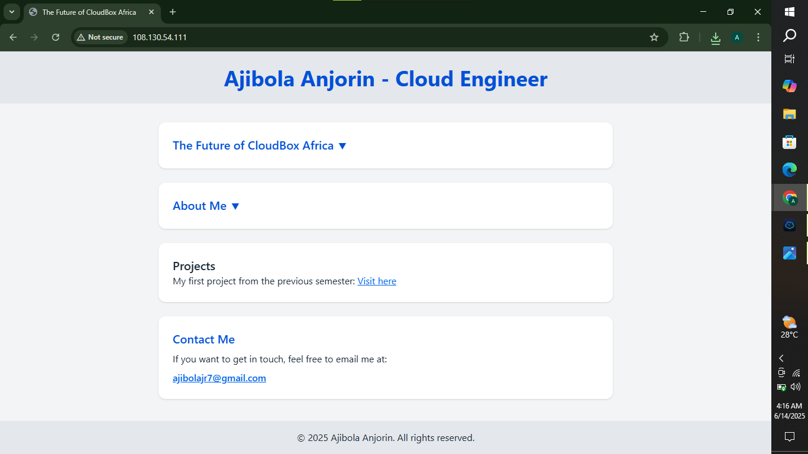

# Altschool-Cloud-Engineering-Second-Semester-Examination-Project

This is my exam project for the second semester at Altschool Africa, where I built a simple landing page, deployed it using Node.js and Nginx, and hosted it on a public IP with system-level background process management.

---

## 📌 Project Summary

- Developed a custom landing page with HTML and Tailwind CSS.
- Created a Node.js server to serve the landing page.
- Configured Nginx as a reverse proxy for handling requests to the Node.js app.
- Set up HTTPS using a self-signed certificate (bonus attempt).
- Ensured server uptime by managing the Node.js app as a systemd service.
- Hosted on a live Ubuntu server (cloud-based VM).

---

## 🌐 Hosted Link

**Public IP:** [http://108.130.54.111](http://108.130.54.111)

---

## 🧠 Steps Taken

### 1. 🔧 Server Setup
- Created a cloud Ubuntu instance.
- Updated and upgraded packages.
- Installed Node.js, Nginx, and other required tools.

### 2. 🌍 Web Server (Nginx)
- Configured Nginx to reverse proxy incoming HTTP requests to the Node.js app.
- Redirected HTTP to HTTPS (bonus task attempted).
- Ensured ports 80 and 443 were open and allowed via firewall.

### 3. 🚀 Deployment
- Created a Node.js server to serve static HTML.
- Deployed the custom landing page to `/var/www/html/`.
- Used `scp` to transfer files from local machine to server.

### 4. ⚙️ Process Management
- Used `nohup` to run the Node.js app in the background temporarily.
- Set up a `systemd` service to manage the Node.js app permanently.
- Enabled the service to start on boot and monitored logs.

### 5. 📂 Version Control
- Initialized Git repo and connected to GitHub.
- Managed commits and pushed final project with documentation.

---

## 🖼️ Screenshot

---

## ✍️ Author

Ajibola Anjorin  
Cloud Engineering Student – Altschool Africa  
Email: ajibolajr@gmail.com

